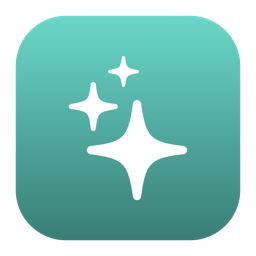

<div align="center">
  
  <h1>Claude Menu Bar</h1>
  <p><b>Claude Code's live status, right in your macOS menu bar.</b></p>
</div>

<div align="center">

[](https://github.com/cdbkk/claude-menubar/releases/latest)


[](https://github.com/cdbkk/claude-menubar/releases)
[](LICENSE)

</div>

A tiny menu bar app that shows what Claude Code is doing: an animated icon while it's thinking or running a tool, a yellow dot when it's awaiting your permission, and the elapsed time of the current turn. No window, no dock icon, no usage dashboards.

> [!NOTE]
> Built for one active Claude Code session at a time. If you run several at once (multiple terminals, or a terminal plus the desktop app), the menu bar follows the most recently active one.

## Install

### Manual (DMG)

1. Download the latest [`ClaudeMenuBar.dmg`](https://github.com/cdbkk/claude-menubar/releases/latest/download/ClaudeMenuBar.dmg).
2. Open it and drag **Claude Menu Bar** into Applications.
3. Right-click the app → **Open** the first time. (The build is ad-hoc signed, not notarized, so Gatekeeper warns once.)
4. Start a new Claude Code session, the icon appears whenever Claude Code is running.

To update, download the latest DMG and replace the app in Applications.

### Claude Code plugin

Installs the hooks from inside Claude Code:

```
/plugin marketplace add cdbkk/claude-menubar
/plugin install claude-menubar@claude-menubar
```

The plugin installs the hooks but not the app, so drag **Claude Menu Bar** into Applications once (from the DMG). It launches automatically on session start.

## Requirements

- macOS 12+
- [Claude Code](https://claude.com/claude-code) (CLI or the Desktop app)
- Node.js

## Features

- **Thinking / working** — the icon animates, with a live `1m 1s` timer.
- **Running a tool** — a short label (`Editing`, `Reading`, `Running command`, …).
- **Awaiting permission** — a paused yellow dot, in both the CLI and the Desktop app.
- **Idle / done** — rests on the logo.

All from the menu bar dropdown:

- **Show timer** — toggle the elapsed `1m 1s` clock.
- **Play completion sound** — a soft chime when a turn longer than a minute finishes (off by default).
- **Animation style** — Claude Spark (the chat "morph" spark), Claude Code (the terminal glyph spinner), or Crab Walking (a pixel-art crab that scuttles while Claude works).
- **Icon color** — Teal or System (adaptive black/white).

## Where it works

| Surface | Tracked? |
|---|---|
| Claude Code CLI (terminal) | ✅ |
| Claude Code Desktop — **Code** tab | ✅ |
| Cursor (Claude Code extension) | ✅ |
| Claude Desktop — **Chat** tab | ❌ |
| **Cowork** | ❌ |

## How it works

The app is stateless. Claude Code hooks write the current status to `~/.claude/statusbar/state.json`; the app polls that file every 0.4s and renders the icon and label. `SessionStart` launches it; it self-quits once the Claude desktop app is closed and no Claude Code session is active.

The installer merges its hooks into `~/.claude/settings.json` (backing it up first). The app makes **no network calls** and has no servers ([details](docs/privacy.md)).

## Building from source

```bash
./build.sh          # builds build/ClaudeMenuBar.app
./build.sh --dmg    # also produces build/ClaudeMenuBar.dmg
```

See [docs/building.md](docs/building.md) for signing and notarization.

## Uninstall

```bash
node "/Applications/ClaudeMenuBar.app/Contents/Resources/uninstall.js"   # removes only our hooks
```

Then drag the app to the Trash.

## Not affiliated with Anthropic

This is an unofficial, open-source side project. **It is not affiliated with, endorsed by, or sponsored by Anthropic.** "Claude" and the Claude spark logo are trademarks of Anthropic, used here nominatively. The MIT license below covers the source code only and conveys no rights to Anthropic's trademarks or brand.

## License

[MIT](LICENSE)
